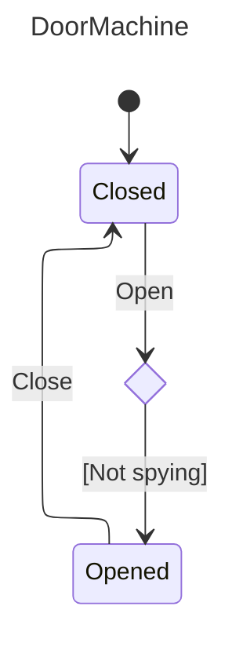

# Nalu.SharpState

[](https://www.nuget.org/packages/Nalu.SharpState/) [](https://www.nuget.org/packages/Nalu.SharpState/) [](https://codecov.io/gh/nalu-development/sharpstate)

**Nalu.SharpState** is a Roslyn source generator for **declarative, strongly typed, hierarchical** state machines in .NET: you declare states and triggers on a `public static partial` class, configure transitions with a **fluent API**, and the generator emits compile-time registration tables and an `IActor` with typed trigger methods.

Optional **`WhenExitedAsync(...)`**, **`WhenEnteredAsync(...)`**, and **`ReactAsync(...)`** run *after* a transition commits. The generated **`IActor`** also exposes matching **`{Trigger}Async`** methods that **await** that post-transition work via **`FireAsync`**; synchronous trigger methods still schedule it fire-and-forget.

Dispatch does not use string dictionaries or runtime reflection, so the machine stays **AOT and trim-friendly** with a **small CPU and memory footprint** on the hot path.

## Install

```bash
dotnet add package Nalu.SharpState
```

The package includes the analyzer; no extra registration call is required.

For **`Microsoft.Extensions.DependencyInjection`** helpers (**`ServiceCollectionStateMachineExtensions`** — `AddScopedStateMachineServiceProviderResolver`, `AddSingletonStateMachineServiceProviderResolver`), add the **`Nalu.SharpState.DependencyInjection`** NuGet package. **`StateMachineServiceProviderResolver`** is in **`Nalu.SharpState`**.

## At a glance

Define a context, mark a `public static partial` class with `[StateMachineDefinition]`, add `[StateTriggerDefinition]` methods for inputs and `[StateDefinition]` properties for states, then wire transitions with `ConfigureState()` (see the full [door sample](Tests/Nalu.SharpState.Tests/EndToEnd/DoorMachine.cs) in the test suite). Actors take an **`IStateMachineServiceProviderResolver`** when created (see [Service provider](https://nalu-development.github.io/sharpstate/index.html#service-provider-and-actor-factories) in the guide).

There is no analyzer-enforced ceiling on **`[StateTriggerDefinition]` parameter count**; for triggers **with** parameters, the generator emits a per-trigger payload type. **Zero-parameter** triggers use an args-less fluent builder (no empty `*Args` struct) and `TriggerArgs.For{Name}()` at the machine boundary. Fluent **`When` / `Invoke` / `ReactAsync`** and lifecycle hooks optionally take up to sixteen **injected dependency** generic parameters (**`T1`…`T16`**), separate from trigger arguments.

```csharp
public class DoorContext
{
    public int OpenCount { get; set; }
    public string? LastReason { get; set; }
}

[StateMachineDefinition(typeof(DoorContext))]
public static partial class DoorMachine
{
    [StateTriggerDefinition] static partial void Open(string reason);
    [StateTriggerDefinition] static partial void Close();

    [StateDefinition(Initial = true)]
    private static IStateConfiguration Closed { get; } = ConfigureState()
        .OnOpen(t => t
            .When((_, args) => args.Reason is not "spying", "Not spying")
            .TransitionTo(State.Opened)
            .Invoke((ctx, args) => { ctx.OpenCount++; ctx.LastReason = args.Reason; }));

    [StateDefinition]
    private static IStateConfiguration Opened { get; } = ConfigureState()
        .OnClose(t => t.TransitionTo(State.Closed));
}
```

Use the generated API from your app:

```csharp
using System;
using Nalu.SharpState;

var door = DoorMachine.CreateActor(new DoorContext(), StateMachineEmptyServiceProviderResolver.Instance);
door.Open("delivery");
Console.WriteLine(door.CurrentState); // Opened
```

### Entry and exit hooks

Per-state **`WhenEntering`** and **`WhenExiting`** run around **external** transitions (not **`Stay()`** / **`Ignore()`**). See [Entry and exit hooks](https://nalu-development.github.io/sharpstate/index.html#entry-and-exit-hooks) in the guide.

### Asynchronous reactions and lifecycle

Use **`WhenExitedAsync`**, **`WhenEnteredAsync`**, and **`ReactAsync`** for work after the state change is visible. Sync **`void`** trigger methods **schedule** that pipeline; generated **`ValueTask`** **`*Async`** trigger methods **await** it and use the engine’s root/captured service provider (no reaction scope). Failures after commit are reported on **`ReactionFailed`**; awaited triggers also throw **`ReactionFailedException`** (see the guide). Scheduled work from sync triggers uses **one** **`CreateScopedServiceProvider`** call per run when using a scoped resolver.

```csharp
[StateDefinition]
private static IStateConfiguration Pending { get; } = ConfigureState()
    .OnRequestApproval(t => t
        .TransitionTo(State.Approving)
        .ReactAsync(async (actor, ctx, args) =>
        {
            try {
                await ctx.ApproveService.ApproveAsync(args.Id);
                await actor.ApproveAsync();
            } catch {
                await actor.RejectAsync();
            }
        }));
```

Details and ordering: [Post-Transition Async Work](https://nalu-development.github.io/sharpstate/sharpstate-async.html).

### Benchmarks

Outperform the industry standard ([Stateless](https://github.com/dotnet-state-machine/stateless)) with **7x to 13x faster execution** and **25x to 30x** lower memory overhead depending on the usage.

| Method             | StateChanges | Mean         | Error      | StdDev     | Gen0      | Gen1     | Allocated   |
|------------------- |------------- |-------------:|-----------:|-----------:|----------:|---------:|------------:|
| SingletonActor     | 100          |     5.509 us |  0.0196 us |  0.0183 us |    0.9537 |        - |     7.81 KB |
| SingletonStateless | 100          |    39.544 us |  0.1018 us |  0.0902 us |   30.0293 |        - |   245.31 KB |
| TransientActor     | 100          |     6.559 us |  0.0236 us |  0.0220 us |    2.6779 |        - |    21.88 KB |
| TransientStateless | 100          |    87.597 us |  0.3544 us |  0.3315 us |   74.5850 |   1.4648 |   610.17 KB |
| SingletonActor     | 10000        |   563.429 us |  1.6667 us |  1.3918 us |   94.7266 |        - |   781.25 KB |
| SingletonStateless | 10000        | 4,003.178 us | 15.1618 us | 14.1824 us | 3000.0000 |        - | 24531.25 KB |
| TransientActor     | 10000        |   671.978 us |  2.1106 us |  1.8710 us |  267.5781 |        - |   2187.5 KB |
| TransientStateless | 10000        | 8,793.037 us | 50.5944 us | 47.3260 us | 7468.7500 | 140.6250 | 61016.85 KB |

See the [benchmarks](https://github.com/nalu-development/sharpstate/tree/main/Tests/Nalu.SharpState.Benchmarks) for more details.

### Dependency Injection and Unit Testing

The generator adds **`CreateActorFactory`** / **`CreateActorWithStateFactory`** delegates aligned with the static `CreateActor` / `CreateActorWithState` overloads that take **`IStateMachineServiceProviderResolver`**, so you can register them in a container, inject them where you build actors, and stub `IActor` in tests. **`StateMachineStaticServiceProviderResolver`** stays in **`Nalu.SharpState`**; **`StateMachineServiceProviderResolver`** is also in **`Nalu.SharpState`** but ships in the **`Nalu.SharpState.DependencyInjection`** assembly; **`ServiceCollectionStateMachineExtensions`** extend **`Microsoft.Extensions.DependencyInjection`** in that same assembly. The context you pass into every transition can still hold domain state; async reactions stay mockable. See [Service provider](https://nalu-development.github.io/sharpstate/index.html#service-provider-and-actor-factories) and [Testability](https://nalu-development.github.io/sharpstate/index.html#testability) in the full guide.

### Visualize the configured state machine

The same type also emits diagrams as text:

- `DoorMachine.ToDot()` returns a **Graphviz DOT** `digraph` you can pass to the `dot` tool (for example `dot -Tpng -o door.png`) or paste into any Graphviz-compatible viewer.
- `DoorMachine.ToMermaid()` returns a **Mermaid** `stateDiagram-v2` document you can paste into Markdown, documentation sites, or Mermaid-compatible viewers.

Both exports are useful for documentation, reviews, or debugging transitions and guards.

For the door sample above, that call produces the DOT below; the diagram is the same graph rendered with Graphviz (`dot -Tsvg`).

<table>
<tr valign="middle">
<td>

<code>
<pre>
digraph G {
  label = "DoorMachine";
  labelloc = t;
  compound = true;
  start [shape=Mdiamond,label="Closed"];

  state_1 [shape=rectangle,label="Opened"];
  trigger_0 [shape=ellipse,label="Close"];
  state_1 -> trigger_0;
  trigger_1 [shape=ellipse,label="Open\n[Not spying]"];
  start -> trigger_1;

  trigger_0 -> start;
  trigger_1 -> state_1;
}
</pre>
</code>

</td>
<td width="35%">


</td>
</tr>
</table>

Mermaid export is often more convenient in Markdown documentation:

<table>
<tr valign="middle">
<td>

<code>
<pre>
---
title: "DoorMachine"
---
%%{init: {"layout": "elk"}}%%
stateDiagram-v2

  state "Closed" as state_0
  state "Opened" as state_1
  [*] --> state_0
  state choice_0 &lt;&lt;choice&gt;&gt;
  state_0 --> choice_0 : Open
  choice_0 --> state_1 : [Not spying]
  state_1 --> state_0 : Close
</pre>
</code>

</td>
<td>



</td>
</tr>
</table>

For dynamic targets, pass labeled hints so diagrams can document the possible runtime branches:

```csharp
.OnRoute(t => t.TransitionTo(
    (ctx, request) => request.IsAdmin ? State.Admin : State.Standard,
    (State.Admin, "Admin request"),
    (State.Standard, "Standard request")))
```

The hint labels are documentation only: they do not affect runtime target resolution.

## Documentation

Full guides (transitions, entry and exit hooks, hierarchy, `ReactAsync`, diagnostics, API reference) live here:

**[https://nalu-development.github.io/sharpstate/](https://nalu-development.github.io/sharpstate/)**

---

## Contributing & building from source

See [CONTRIBUTING.md](CONTRIBUTING.md).


