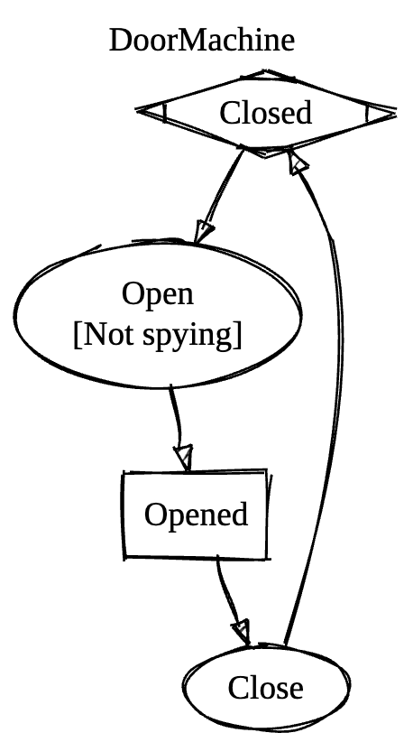

# Nalu.SharpState

[](https://www.nuget.org/packages/Nalu.SharpState/) [](https://www.nuget.org/packages/Nalu.SharpState/)

**Nalu.SharpState** is a Roslyn source generator for **strongly typed, hierarchical state machines** in .NET: you declare states and triggers in a `partial` class, configure transitions with a fluent API, and the generator emits an `IActor` with typed trigger methods—no string dictionaries, no runtime reflection, AOT-friendly.

## Install

```bash
dotnet add package Nalu.SharpState
```

The package includes the analyzer; no extra registration call is required.

## At a glance

Define a context (with eventual service dependencies), mark a `partial` class with `[StateMachineDefinition]`, add `[StateTriggerDefinition]` methods for inputs and `[StateDefinition]` properties for states, then wire transitions with `ConfigureState()` (see the full [door sample](Tests/Nalu.SharpState.Tests/EndToEnd/DoorMachine.cs) in the test suite):

```csharp
public class DoorContext
{
    public int OpenCount { get; set; }
    public string? LastReason { get; set; }
}

[StateMachineDefinition(typeof(DoorContext))]
public partial class DoorMachine
{
    [StateTriggerDefinition] static partial void Open(string reason);
    [StateTriggerDefinition] static partial void Close();

    [StateDefinition(Initial = true)]
    private static IStateConfiguration Closed { get; } = ConfigureState()
        .OnOpen(t => t
            .When((_, reason) => reason is not "spying", "Not spying")
            .Target(State.Opened)
            .Invoke((ctx, reason) => { ctx.OpenCount++; ctx.LastReason = reason; }));

    [StateDefinition]
    private static IStateConfiguration Opened { get; } = ConfigureState()
        .OnClose(t => t.Target(State.Closed));
}
```

Use the generated API from your app:

```csharp
var door = DoorMachine.CreateActor(new DoorContext());
door.Open("delivery");
Console.WriteLine(door.CurrentState); // Opened
```

### Asynchronous reactions

The synchronous trigger API can still schedule async follow-up work after a transition commits; the callback gets the `IActor` and can fire more triggers (for example after `await`ing a service on the context):

```csharp
[StateDefinition]
private static IStateConfiguration Pending { get; } = ConfigureState()
    .OnRequestApproval(t => t
        .Target(State.Approving)
        .ReactAsync(async (actor, ctx, id) =>
        {
            try {
                await ctx.ApproveService.ApproveAsync(id);
                actor.Approve();
            } catch {
                actor.Reject();
            }
        }));
```

Details and ordering: [Post-Transition Reactions](https://nalu-development.github.io/sharpstate/sharpstate-async.html).

### Dependency Injection and Unit Testing

The generator adds `CreateActorFactory` and `CreateActorWithStateFactory` (aligned with `CreateActor` / `CreateActorWithState`) so you can register the delegate in a container, inject it where you build actors, and stub `IActor` in tests—`CreateActorFactory` is the typical choice when the default initial state is enough. The context you pass into every transition can hold your services, so async reactions such as the `ReactAsync` block above keep dependencies mockable. See [Testability](https://nalu-development.github.io/sharpstate/index.html#testability) in the full guide.

### Visualize the configured state machine

The same type also emits a **Graphviz** diagram as text: `DoorMachine.ToDot()` returns a `digraph` you can pass to the `dot` tool (for example `dot -Tpng -o door.png`) or paste into any Graphviz-compatible viewer—useful for documentation, reviews, or debugging transitions and guards.

For the door sample above, that call produces the DOT below; the diagram is the same graph rendered with Graphviz (`dot -Tpng`).

<table>
<tr valign="top">
<td>

<pre>
digraph G {
  label = "DoorMachine";
  labelloc = t;
  compound = true;
  start [shape=Mdiamond,label="Closed"];

  state_1 [shape=rectangle,label="Opened"];
  trigger_0 [shape=ellipse,label="Close"];
  state_1 -> trigger_0;
  trigger_1 [shape=ellipse,label="Open\n[Not spying]"];
  start -> trigger_1;

  trigger_0 -> start;
  trigger_1 -> state_1;
}
</pre>

</td>
<td width="35%">



</td>
</tr>
</table>

## Documentation

Full guides (transitions, hierarchy, `ReactAsync`, diagnostics, API reference) live here:

**[https://nalu-development.github.io/sharpstate/](https://nalu-development.github.io/sharpstate/)**

---

## Contributing & building from source

See [CONTRIBUTING.md](CONTRIBUTING.md).

## License

[MIT](LICENSE.md)
