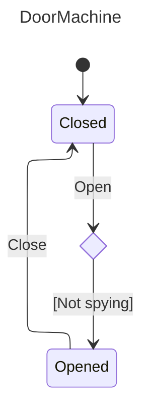

# Nalu.SharpState

[](https://www.nuget.org/packages/Nalu.SharpState/) [](https://www.nuget.org/packages/Nalu.SharpState/) [](https://codecov.io/gh/nalu-development/sharpstate)

A compile-time, AOT-friendly state machine for .NET built on a Roslyn source generator. You declare states and triggers with attributes, describe transitions with a strongly-typed fluent API, and the generator emits a ready-to-use `IActor` surface with typed trigger methods.

## Why SharpState?

Classic state machine libraries rely on reflection, dictionaries keyed by strings/enums at runtime, and `object[]` parameter bags. That costs boxing, breaks AOT, and pushes errors from compile time to the first user interaction.

`Nalu.SharpState` takes the opposite route:

- **Declarative**: states and triggers are C# constructs (a `static partial` method is a trigger, a `static` property is a state).
- **Strongly typed**: trigger parameters become method parameters on the generated actor. Guards and actions see the exact types you declared.
- **Compile-time validated**: duplicate names, unreachable hierarchies, and misconfigured sub-machines become build errors via dedicated `NSS001`–`NSS010` diagnostics.
- **AOT / trim friendly**: zero reflection at runtime. The generator emits the registration tables at compile time.
- **Hierarchical**: composite states are modeled as nested `[SubStateMachine]` partial classes with strict scoping rules.
- **Sync transitions**: state changes always commit synchronously, so guards, target selection, `Invoke`, entry/exit hooks, context notification, and `StateChanged` complete before post-transition async work begins.
- **Async-friendly follow-up**: generated actors expose both synchronous `void` trigger methods (`Open`, `Close`, …), which schedule post-transition async work fire-and-forget, and matching `ValueTask` `*Async` methods, which await `WhenExitedAsync`, `WhenEnteredAsync`, and `ReactAsync`; see [Post-Transition Async Work](sharpstate-async.md).
- **Lightweight on CPU and memory**: tables are emitted at compile time and dispatch is direct, so transitions spend less time on the hot path and allocate far less than typical reflection or dictionary-heavy approaches. The [Benchmarks](#benchmarks) section compares `Nalu.SharpState` to [Stateless](https://github.com/dotnet-state-machine/stateless) on the same scenarios.

## Installation

```bash
dotnet add package Nalu.SharpState
```

The package bundles the source generator, so no additional setup or `UseXxx(...)` call is required.

Optional **`dotnet add package Nalu.SharpState.DependencyInjection`** brings in **`Microsoft.Extensions.DependencyInjection`** (8.0.x on `net8.0`, 10.0.x on `net10.0`) and adds **`StateMachineServiceProviderResolver`** (namespace **`Nalu.SharpState`**) plus **`ServiceCollectionStateMachineExtensions`** in **`Microsoft.Extensions.DependencyInjection`** (`AddScopedStateMachineServiceProviderResolver`, `AddSingletonStateMachineServiceProviderResolver`).


## Anatomy of a machine

A machine lives in a single `static partial class` (for example `public static partial class MyMachine`) marked with `[StateMachineDefinition]`. It is made of four building blocks:

| Building block | Declared as | Role |
|----------------|-------------|------|
| **Context** | Any class you own | Holds **machine-facing state** (counters, domain fields, flags the guards and actions update). Passed as the first argument to `[StateMachineDefinition]`. Prefer requesting **services** (`ILogger`, repositories, `HttpClient`, …) as callback parameters in `When` / `Invoke` / `ReactAsync` overloads rather than storing them on the context. |
| **Service provider** | `IServiceProvider` | Supplies injected callback services and, for scheduled post-transition async work, optionally scoped services. See [Service provider and actor factories](#service-provider-and-actor-factories). |
| **Triggers** | `[StateTriggerDefinition] static partial void` methods | Inputs to the machine. Their parameter list becomes the dispatch signature. The generator emits a per-trigger args type (`{Trigger}Args`) plus a machine-wide tagged **`TriggerArgs`** for dispatch into callbacks. Fluent `When` / `Invoke` / `ReactAsync` / lifecycle hooks optionally take **injectable services** as generic **`T1`…`T16`** overload parameters (distinct from trigger payload arity). |
| **States** | `[StateDefinition] static IStateConfiguration` properties | Nodes of the machine. The property body configures outgoing transitions. |

Here is a minimal door:

```csharp
using Nalu.SharpState;

public class DoorContext
{
    public int OpenCount { get; set; }
    public string? LastReason { get; set; }
}

[StateMachineDefinition(typeof(DoorContext))]
public static partial class DoorMachine
{
    [StateTriggerDefinition] static partial void Open(string reason);
    [StateTriggerDefinition] static partial void Close();

    [StateDefinition(Initial = true)]
    private static IStateConfiguration Closed { get; } = ConfigureState()
        .OnOpen(t => t
            .TransitionTo(State.Opened)
            .Invoke((ctx, args) =>
            {
                ctx.OpenCount++;
                ctx.LastReason = args.Reason;
            }));

    [StateDefinition]
    private static IStateConfiguration Opened { get; } = ConfigureState()
        .OnClose(t => t.TransitionTo(State.Closed));
}
```

The generator produces:

- A `State` enum with the values `Closed, Opened`.
- A `Trigger` enum with the values `Open, Close`.
- A nested `public interface IActor` exposing `CanOpen(string)`, `Open(string)`, `OpenAsync(string)`, `CanClose()`, `Close()`, `CloseAsync()`, `CurrentState`, `Context`, `IsIn(...)`, `StateChanged`, `ReactionFailed`, and `OnUnhandled`.
- Nested factory delegates for dependency injection:
  - `CreateActorFactory` / `CreateActorWithStateFactory` — match `CreateActor(context, IStateMachineServiceProviderResolver serviceProviderResolver)` and `CreateActorWithState(..., resolver, state)`.
- A `public static State GetInitialState()` helper for the root machine.
- A `public static string ToDot()` helper that renders the machine as a Graphviz DOT graph.
- A `public static string ToMermaid()` helper that renders the machine as a Mermaid `stateDiagram-v2`.
- `public static IActor CreateActor(DoorContext context, IStateMachineServiceProviderResolver serviceProviderResolver)` and `CreateActorWithState(..., resolver, state)`.

Usage:

```csharp
using System;
using System.Threading.Tasks;
using Microsoft.Extensions.DependencyInjection;
using Nalu.SharpState;

IServiceProvider root = ...; // e.g. Host.Services or another composition root

var scopeFactory = root.GetRequiredService<IServiceScopeFactory>();
var resolver = new StateMachineServiceProviderResolver(root, scopeFactory);
var door = DoorMachine.CreateActor(new DoorContext(), resolver);

door.Open("delivery");           // sync trigger; post-transition async is scheduled
// or
await door.OpenAsync("delivery");  // awaits WhenExitedAsync → WhenEnteredAsync → ReactAsync

Console.WriteLine(door.CurrentState);     // Opened
Console.WriteLine(door.Context.OpenCount); // 1
```

Add the **`Nalu.SharpState.DependencyInjection`** package and use **`Nalu.SharpState.StateMachineServiceProviderResolver`**. The actor captures `GetServiceProvider()` for synchronous guards, target selectors, actions, and for **`FireAsync`**. Scheduled post-transition work after **`Fire`** uses **one** reaction-scoped provider from `CreateScopedServiceProvider` per run. See [Service provider and actor factories](#service-provider-and-actor-factories) and [Post-Transition Async Work](sharpstate-async.md).

## Service provider and actor factories

SharpState only uses **`IServiceProvider`** for dependency injection. The `[StateMachineDefinition]` attribute describes the context type only:

```csharp
[StateMachineDefinition(typeof(DoorContext))]
public static partial class DoorMachine;
```

**`IStateMachineServiceProviderResolver`** has two jobs:

- `GetServiceProvider()` supplies the provider captured by the actor for synchronous `When`, `TransitionTo`, `Invoke`, `WhenEntering`, and `WhenExiting` clauses, and for **`FireAsync`** / generated **`{Trigger}Async`** post-transition work.
- `CreateScopedServiceProvider(out IServiceProvider)` supplies a provider for **scheduled** post-transition work after synchronous **`Fire`** / `void` trigger methods. The engine calls it **once** per scheduled pipeline (async lifecycle hooks plus **`ReactAsync`**) and disposes the token when that pipeline completes. See [Post-Transition Async Work](sharpstate-async.md) for ordering and failure behavior.

For machines that do not resolve services, pass **`StateMachineEmptyServiceProviderResolver.Instance`**:

```csharp
var actor = MyMachine.CreateActor(context, StateMachineEmptyServiceProviderResolver.Instance);
```

Use **`StateMachineStaticServiceProviderResolver`** (in **`Nalu.SharpState`**) when synchronous clauses and post-transition async work should reuse the same provider. Use **`StateMachineServiceProviderResolver`** (**`Nalu.SharpState`** namespace, **`Nalu.SharpState.DependencyInjection`** package) when scheduled post-transition work from synchronous triggers should create a child Microsoft DI scope via **`IServiceScopeFactory`**.

```csharp
using Microsoft.Extensions.DependencyInjection;
using Nalu.SharpState;

IServiceProvider root = ...; // e.g. Host.Services
var factory = root.GetRequiredService<IServiceScopeFactory>();

var resolver = new StateMachineServiceProviderResolver(root, factory);
var actor = MyMachine.CreateActor(context, resolver);
```

A custom resolver is small:

```csharp
sealed class SameInstanceResolver : IStateMachineServiceProviderResolver
{
    private readonly IServiceProvider _instance;
    public SameInstanceResolver(IServiceProvider instance) => _instance = instance;
    public IServiceProvider GetServiceProvider() => _instance;

    public IDisposable CreateScopedServiceProvider(out IServiceProvider serviceProvider)
    {
        serviceProvider = _instance;
        return NoopDisposable.Instance;
    }

    private sealed class NoopDisposable : IDisposable
    {
        public static readonly NoopDisposable Instance = new();
        public void Dispose() { }
    }
}
```

#### Scoped Post-Transition Services

With **`StateMachineServiceProviderResolver`**, **`CreateScopedServiceProvider`** opens a child scope via **`IServiceScopeFactory`** for scheduled post-transition work after synchronous triggers. Request services as callback parameters; SharpState resolves them with `IServiceProvider.GetService(typeof(T))` and throws if the result is `null`.

```csharp
// Startup
services.AddScoped<IEmailDispatcher, EmailDispatcher>();

// Registers StateMachineServiceProviderResolver as scoped (see Nalu.SharpState.DependencyInjection)
services.AddScopedStateMachineServiceProviderResolver();

// Machine definition (excerpt)
.ReactAsync<IEmailDispatcher>(async (actor, ctx, args, mail) =>
{
    await mail.SendConfirmationAsync(args.OrderId);
})
```

To change how the scheduled post-transition scope is produced, subclass **`StateMachineServiceProviderResolver`** and override **`CreateScopedServiceProvider`**, or implement **`IStateMachineServiceProviderResolver`** directly.

## Describing transitions

Inside each `[StateDefinition]` property body you call `ConfigureState()` and chain one `On<TriggerName>(t => ...)` per trigger the state reacts to. The builder is split into two phases:

| Method | Purpose |
|--------|---------|
| `TransitionTo(State s)` | Move to `s` when the trigger fires. If `s` is composite, its initial-child chain is resolved to a leaf. |
| `TransitionTo((ctx, args) => State.X, ...)` | Compute the target at fire time from the context and the generated trigger args struct. Extra service parameters can be requested with generic overloads up to `T16`. Optional trailing target hints document possible destinations for diagrams only. |
| `Stay()` | Run the action but keep the current state. `StateChanged` is not raised. |
| `Ignore()` | Syntax sugar for `Stay()` with no action. |
| `When(predicate, label = null)` | Guards the transition before `TransitionTo(...)` or `Stay()`. Overloads start with `(context, args)` and can request services as `T1..T16` callback parameters. |
| `Invoke(action)` | Runs side effects before the state commits. Overloads start with `(context, args)` and can request services as callback parameters. |
| `ReactAsync(action)` | Runs after async exit and entry hooks in the post-transition pipeline. Synchronous triggers schedule it fire-and-forget; async triggers await it. Overloads start with `(actor, context, args)` and can request services as callback parameters. |
| `WhenEntering(action)` | Runs after the state commits on an external transition into this state. Overloads start with `(context)` and can request services as callback parameters; lifecycle hooks do not receive trigger args. |
| `WhenExiting(action)` | Runs before the state is left on an external transition. Same shape as `WhenEntering`. |

If a dynamic `TransitionTo(...)` resolves to the current leaf state for a specific fire, SharpState treats that fire like an internal transition: no exit hooks, no state commit, no entry hooks, and no `StateChanged`.

You can register multiple transitions for the same trigger in the same state; the first one whose guard passes (or has no guard) wins:

```csharp
[StateDefinition]
private static IStateConfiguration Idle { get; } = ConfigureState()
    .OnStart(t => t
        .When((ctx, args) => args.User.IsAdmin)
        .TransitionTo(State.AdminDashboard))
    .OnStart(t => t
        .TransitionTo(State.UserDashboard));
```

If no transition matches, the `OnUnhandled` callback fires.

### Entry and exit hooks

States can react to external transitions with `WhenEntering(...)` and `WhenExiting(...)`. Use the context for state the machine owns, and request application services as typed callback parameters when needed.

```csharp
[StateDefinition]
private static IStateConfiguration Running { get; } = ConfigureState()
    .WhenEntering<TimeProvider>((ctx, time) =>
    {
        ctx.IsRunning = true;
        ctx.RunningStartedUtc = time.GetUtcNow().UtcDateTime;
    })
    .WhenExiting(ctx => ctx.IsRunning = false)
    .OnStop(t => t
        .TransitionTo(State.Stopped)
        .Invoke<Microsoft.Extensions.Logging.ILoggerFactory>((ctx, args, loggerFactory) =>
            loggerFactory.CreateLogger(nameof(MyMachine))
                .LogInformation("Stopped; run began at {Started:o}", ctx.RunningStartedUtc)));
```

Hooks run only for external transitions:

- Exit hooks run from the current leaf upward until the lowest common ancestor with the destination.
- Entry hooks run from that ancestor's child down to the new leaf.
- Internal transitions (`Stay()` / `Ignore()`) do not fire entry or exit hooks.

When you need services after `StateChanged`, add async lifecycle hooks or a `ReactAsync((actor, ctx, args, service) => ...)` overload. Synchronous triggers use one scoped provider for the whole scheduled post-transition pipeline; `*Async` triggers use the actor's captured provider.

## Interacting with the actor

The generated `IActor` exposes everything you need at runtime:

```csharp
using System;
using Microsoft.Extensions.DependencyInjection;
using Microsoft.Extensions.Logging;
using Nalu.SharpState;

IServiceProvider services = ...;
var resolver = new StateMachineServiceProviderResolver(services, services.GetRequiredService<IServiceScopeFactory>());

var door = DoorMachine.CreateActor(new DoorContext(), resolver);

door.StateChanged += (from, to, trigger, args) =>
    ((ILoggerFactory)services.GetService(typeof(ILoggerFactory))!).CreateLogger("Door")
        .LogInformation("{From} -> {To} via {Trigger}", from, to, trigger);

door.OnUnhandled = (current, trigger, args) =>
    ((ILoggerFactory)services.GetService(typeof(ILoggerFactory))!).CreateLogger("Door")
        .LogWarning("{Trigger} ignored while in {State}", trigger, current);

door.Open("delivery");
Console.WriteLine(door.CurrentState);         // Opened
Console.WriteLine(door.IsIn(DoorMachine.State.Opened)); // true
```

| Member | Description |
|--------|-------------|
| `CurrentState` | Current **leaf** state. When the machine is in a nested composite it always reports the leaf. |
| `Context` | The context instance supplied to `CreateActor` / `CreateActorWithState` — use it for **state** the machine owns (balances, open counts, UI flags). **`IStateMachineServiceProviderResolver`** is separate; request services in fluent overloads or resolve them from your host when handling events. |
| `IsIn(State s)` | `true` if `CurrentState` equals `s` **or** is a descendant of `s`. Use this to query composites. |
| `StateChanged` | `StateChangedHandler<State, Trigger>` raised **after** a non-internal transition commits. |
| `ReactionFailed` | Raised when post-transition async work throws after the transition already completed. |
| `OnUnhandled` | Invoked when a trigger has no matching transition on the leaf nor on any ancestor. |
| `Can<Trigger>(...)` | Returns whether the corresponding trigger currently has a matching transition for the supplied arguments. |
| `<Trigger>(...)` | One strongly-typed `void` method per trigger. |

### Context notifications (`IStateAwareContext`)

If your context class implements `IStateAwareContext<State>`, the runtime invokes `OnStateChanged(State)` with the new **leaf** after exit/sync/entry work completes and **before** `StateChanged` is raised. Use this when the context should track the active leaf without subscribing to the event. It applies only to external transitions that change the leaf—not internal `Stay()`, fires where a dynamic `TransitionTo` resolves to the same leaf, or unhandled triggers.

```csharp
public sealed class MyContext : IStateAwareContext<MyMachine.State>
{
    public void OnStateChanged(MyMachine.State state) { /* mirror leaf on context */ }
}
```

### Benchmarks

Outperform the industry standard ([Stateless](https://github.com/dotnet-state-machine/stateless)) with **7x to 13x faster execution** and **25x to 30x** lower memory overhead depending on the usage.

| Method             | StateChanges | Mean         | Error      | StdDev     | Gen0      | Gen1     | Allocated   |
|------------------- |------------- |-------------:|-----------:|-----------:|----------:|---------:|------------:|
| SingletonActor     | 100          |     5.509 us |  0.0196 us |  0.0183 us |    0.9537 |        - |     7.81 KB |
| SingletonStateless | 100          |    39.544 us |  0.1018 us |  0.0902 us |   30.0293 |        - |   245.31 KB |
| TransientActor     | 100          |     6.559 us |  0.0236 us |  0.0220 us |    2.6779 |        - |    21.88 KB |
| TransientStateless | 100          |    87.597 us |  0.3544 us |  0.3315 us |   74.5850 |   1.4648 |   610.17 KB |
| SingletonActor     | 10000        |   563.429 us |  1.6667 us |  1.3918 us |   94.7266 |        - |   781.25 KB |
| SingletonStateless | 10000        | 4,003.178 us | 15.1618 us | 14.1824 us | 3000.0000 |        - | 24531.25 KB |
| TransientActor     | 10000        |   671.978 us |  2.1106 us |  1.8710 us |  267.5781 |        - |   2187.5 KB |
| TransientStateless | 10000        | 8,793.037 us | 50.5944 us | 47.3260 us | 7468.7500 | 140.6250 | 61016.85 KB |

See the [benchmarks](https://github.com/nalu-development/sharpstate/tree/main/Tests/Nalu.SharpState.Benchmarks) for more details.

### Graphviz and Mermaid export

Every generated machine also exposes `ToDot()` and `ToMermaid()` helpers for visualizing transitions, guard labels, dynamic targets, and hierarchy.

- `ToDot()` returns a **Graphviz** DOT string. Pass it to the `dot` tool (e.g. `dot -Tpng -o door.png`) or any compatible viewer.
- `ToMermaid()` returns a **Mermaid** `stateDiagram-v2` document with YAML front matter for the diagram title. Paste it into Markdown, documentation sites, or any Mermaid-compatible viewer.

```csharp
var dot = DoorMachine.ToDot();
Console.WriteLine(dot);

var mermaid = DoorMachine.ToMermaid();
Console.WriteLine(mermaid);
```

The first example on this page is the [door sample](https://github.com/nalu-development/sharpstate/tree/main/Tests/Nalu.SharpState.Tests/EndToEnd/DoorMachine.cs) (`DoorMachine` / `DoorContext`). The DOT below is what `DoorMachine.ToDot()` emits; the image is the same file rendered with `dot -Tpng`.

<table>
<tr valign="middle">
<td>

<code>
<pre>
digraph G {
  label = "DoorMachine";
  labelloc = t;
  compound = true;
  start [shape=Mdiamond,label="Closed"];

  state_1 [shape=rectangle,label="Opened"];
  trigger_0 [shape=ellipse,label="Close"];
  state_1 -> trigger_0;
  trigger_1 [shape=ellipse,label="Open\n[Not spying]"];
  start -> trigger_1;

  trigger_0 -> start;
  trigger_1 -> state_1;
}
</pre>
</code>

</td>
<td width="35%">


</td>
</tr>
</table>

More generally, the DOT export uses rectangles for states, ellipses for triggers, and incorporates guard labels from `When(..., label)` inside the trigger label (for example `Open\n[Not spying]`), as in the [transition table](#describing-transitions) above. Cluster subgraphs represent nested regions; `start` marks the root initial state when applicable; terminal states with no outgoing transitions use `Msquare`.

Mermaid export uses state declarations and arrows directly. Guards and dynamic target hints are rendered with Mermaid `<<choice>>` nodes so branch labels sit on the outgoing paths:

<table>
<tr valign="middle">
<td>

<code>
<pre>
---
title: "DoorMachine"
---
%%{init: {"layout": "elk"}}%%
stateDiagram-v2

  state "Closed" as state_0
  state "Opened" as state_1
  [*] --> state_0
  state choice_0 &lt;&lt;choice&gt;&gt;
  state_0 --> choice_0 : Open
  choice_0 --> state_1 : [Not spying]
  state_1 --> state_0 : Close
</pre>
</code>

</td>
<td>



</td>
</tr>
</table>

**Dynamic targets.** If you use `TransitionTo(selector)` without passing optional target hints, the diagram shows a single **Dynamic target** placeholder because the engine cannot know branches statically. Pass trailing labeled hints to document possible destinations:

```csharp
.OnRoute(t => t.TransitionTo(
    (ctx, args) => args.Request.IsAdmin ? State.AdminDashboard : State.UserDashboard,
    (State.AdminDashboard, "Admin request"),
    (State.UserDashboard, "Standard request")))
```

`ToDot()` and `ToMermaid()` then draw one branch per distinct hinted destination and include the hint label (for example `[Admin request]`) on that branch. Hints affect diagrams only, not runtime target resolution.

**Stay on a composite.** Graphviz does not support edges that start or end on a subgraph border. For an internal transition configured on a composite state, the exporter adds an invisible point node inside that cluster and renders the trigger plus `trigger → anchor → trigger` **after** the subgraph’s closing brace so the layout stays valid while still showing the self-loop semantics.

Mermaid can name composite states directly, so `Stay()` on a composite is rendered as a self-loop on the composite state after the composite block closes.

When multiple Mermaid transitions share the same source and target (for example several `Stay()` triggers on the same state), the exporter emits one edge and joins distinct labels with ` / ` so Mermaid does not hide earlier labels.

### Testability

For application code, prefer injecting the generated **factory delegates** instead of calling the static `CreateActor` / `CreateActorWithState` methods from many places.

Register **`CreateActorFactory`** / **`CreateActorWithStateFactory`** and inject **`IStateMachineServiceProviderResolver`** (for example **`StateMachineServiceProviderResolver`** from **`Nalu.SharpState`** via the **`Nalu.SharpState.DependencyInjection`** package, **`StateMachineStaticServiceProviderResolver`** from **`Nalu.SharpState`**, or your own resolver implementation).

```csharp
services.AddSingleton<DoorMachine.CreateActorFactory>(DoorMachine.CreateActor);

public sealed class DoorWorkflow
{
    private readonly DoorMachine.CreateActorFactory _createDoor;

    public DoorWorkflow(DoorMachine.CreateActorFactory createDoor) => _createDoor = createDoor;

    public DoorMachine.IActor Start(DoorContext context, IStateMachineServiceProviderResolver resolver) =>
        _createDoor(context, resolver);
}
```

If you need a specific starting `State` instead of the root initial state, use the matching **`…WithStateFactory`** delegate and pass `State` as the last argument.

This keeps actor creation DI-friendly and unit-testable:

- tests can replace a factory delegate with a lambda
- the lambda can return a mocked or fake `DoorMachine.IActor`
- production code can still use the static `DoorMachine.CreateActor` / `CreateActorWithState` overloads as the implementation behind the delegate

### Unit testing

With `NSubstitute`, a unit test can stub both the factory and the generated actor:

```csharp
var actor = Substitute.For<DoorMachine.IActor>();
var factory = Substitute.For<DoorMachine.CreateActorFactory>();
factory(Arg.Any<DoorContext>(), Arg.Any<IStateMachineServiceProviderResolver>()).Returns(actor);

var workflow = new DoorWorkflow(factory);
var resolver = Substitute.For<IStateMachineServiceProviderResolver>();
var result = workflow.Start(new DoorContext(), resolver);

result.Should().BeSameAs(actor);
```

And if your application code calls triggers on the actor, you can verify those too:

```csharp
var actor = Substitute.For<DoorMachine.IActor>();

actor.Open("delivery");

actor.Received().Open("delivery");
```

### Unhandled triggers

`OnUnhandled` defaults to a handler that throws `InvalidOperationException` with the current state and trigger in the message. This surfaces programming mistakes early (e.g. firing `Close` while the door is already closed and no `.OnClose` is configured for that state).

You have three options:

```csharp
// 1) Default: throws on unhandled
door.Open("again");  // InvalidOperationException if not configured

// 2) Custom handler (logging, metrics, retries...)
door.OnUnhandled = (state, trigger, args) =>
    telemetry.Track("UnhandledTrigger", state, trigger);

// 3) Opt out: silent no-op
door.OnUnhandled = null;
```

If a trigger should be accepted silently from a given state, prefer modeling that directly:

```csharp
[StateDefinition]
private static IStateConfiguration Running { get; } = ConfigureState()
    .OnHeartbeat(t => t.Ignore());
```

### StateChanged

`StateChanged` fires once per committed transition, with the original leaf, the new leaf, the trigger, and a `TriggerArgs` value carrying the trigger payload. If the context implements `IStateAwareContext<State>`, `OnStateChanged` on the context runs **first** (see [Context notifications](#context-notifications-istateawarecontext)).

- Use `args.TryGetValue(out DoorMachine.OpenArgs open)` or similar to inspect the trigger-specific payload without boxing.

```csharp
door.StateChanged += (from, to, trigger, args) => { /* log, react, ... */ };
```

It is **not** raised when:

- The transition is internal (`.Stay()`).
- A dynamic `TransitionTo(...)` resolves to the current leaf, so that fire collapses into internal behavior.
- The trigger was unhandled (`OnUnhandled` is raised instead).

## Guards and actions

Guards and actions receive the context and the generated trigger args struct. Extra callback parameters request services from `IServiceProvider`; SharpState resolves them with `GetService(typeof(T))` and throws if a required service is missing.

```csharp
[StateTriggerDefinition] static partial void Withdraw(decimal amount, string note);

[StateDefinition]
private static IStateConfiguration Open { get; } = ConfigureState()
    .OnWithdraw(t => t
        .When((ctx, args) => args.Amount <= ctx.Balance)
        .TransitionTo(State.Open)
        .Invoke<ILogger<AccountContext>>((ctx, args, logger) =>
        {
            logger.LogInformation("Withdrawing {Amount} ({Note})", args.Amount, args.Note);
            ctx.Balance -= args.Amount;
            ctx.Ledger.Add(($"-{args.Amount}", args.Note));
        }))
    .OnWithdraw(t => t
        .Stay()
        .Invoke<ILogger<AccountContext>>((ctx, args, logger) =>
        {
            logger.LogWarning("Insufficient funds for {Amount}", args.Amount);
            ctx.Ledger.Add((args.Note, $"insufficient for {args.Amount}"));
        }));
```

Guards are pure predicates; keep them free of side effects. `Invoke(...)` runs inline during dispatch and any exception it throws propagates out of the trigger before the new state is committed.

### Post-Transition Async Work

Use `WhenExitedAsync(...)`, `WhenEnteredAsync(...)`, and `ReactAsync(...)` when the transition should commit before asynchronous follow-up work runs. `ReactAsync` callbacks start with `(actor, context, args)` and can request services after that.

```csharp
[StateDefinition]
private static IStateConfiguration Pending { get; } = ConfigureState()
    .OnRequestApproval(t => t
        .TransitionTo(State.Approving)
        .ReactAsync<IApprovalService>(async (actor, ctx, args, approvals) =>
        {
            try {
                await approvals.ApproveAsync(args.Id);
                await actor.ApproveAsync();
            } catch {
                await actor.RejectAsync();
            }
        }));
```

For external transitions, the order is:

1. `WhenExiting(...)`
2. `Invoke(...)`
3. state commit
4. `WhenEntering(...)`
5. `StateChanged`
6. `WhenExitedAsync(...)`
7. `WhenEnteredAsync(...)`
8. `ReactAsync(...)`

Synchronous triggers capture the current `SynchronizationContext` and schedule that pipeline. Generated `*Async` triggers await it inline and allow reactions to fire more async triggers after the first transition has committed. If post-transition async work throws, the exception is surfaced through `ReactionFailed`; awaited triggers also throw `ReactionFailedException`.

## What next?

- [Hierarchical State Machines](sharpstate-hierarchy.md) — nested composite states via `[SubStateMachine]`.
- [Post-Transition Async Work](sharpstate-async.md) — async lifecycle hooks, `ReactAsync(...)`, `*Async` triggers, and `ReactionFailed`.
- [Diagnostics & Troubleshooting](sharpstate-diagnostics.md) — generator errors (`NSS001`–`NSS010`) and common pitfalls.
