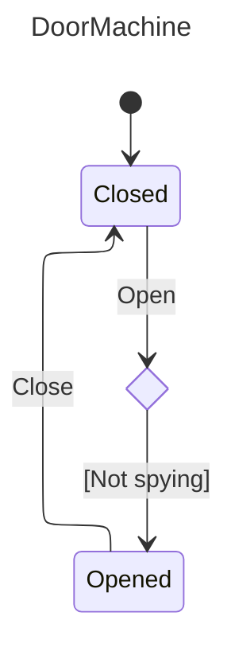

# Nalu.SharpState

[](https://www.nuget.org/packages/Nalu.SharpState/) [](https://www.nuget.org/packages/Nalu.SharpState/) [](https://codecov.io/gh/nalu-development/sharpstate)

A compile-time, AOT-friendly state machine for .NET built on a Roslyn source generator. You declare states and triggers with attributes, describe transitions with a strongly-typed fluent API, and the generator emits a ready-to-use `IActor` surface with typed trigger methods.

## Why SharpState?

Classic state machine libraries rely on reflection, dictionaries keyed by strings/enums at runtime, and `object[]` parameter bags. That costs boxing, breaks AOT, and pushes errors from compile time to the first user interaction.

`Nalu.SharpState` takes the opposite route:

- **Declarative**: states and triggers are C# constructs (a `static partial` method is a trigger, a `static` property is a state).
- **Strongly typed**: trigger parameters become method parameters on the generated actor. Guards and actions see the exact types you declared.
- **Compile-time validated**: duplicate names, unreachable hierarchies, and misconfigured sub-machines become build errors via dedicated `NSS001`–`NSS011` diagnostics.
- **AOT / trim friendly**: zero reflection at runtime. The generator emits the registration tables at compile time.
- **Hierarchical**: composite states are modeled as nested `[SubStateMachine]` partial classes with strict scoping rules.
- **Sync-first**: generated actors stay synchronous, with optional fire-and-forget `ReactAsync(...)` callbacks for post-transition work.
- **Lightweight on CPU and memory**: tables are emitted at compile time and dispatch is direct, so transitions spend less time on the hot path and allocate far less than typical reflection- or dictionary-heavy approaches. The [Benchmarks](#benchmarks) section compares `Nalu.SharpState` to [Stateless](https://github.com/dotnet-state-machine/stateless) on the same scenarios.

## Installation

```bash
dotnet add package Nalu.SharpState
```

The package bundles the source generator, so no additional setup or `UseXxx(...)` call is required.

When you use **`Microsoft.Extensions.DependencyInjection`** with **`IServiceProvider`** as the machine’s service-provider type, add the companion package for a ready-made resolver and registration helpers:

```bash
dotnet add package Nalu.SharpState.DependencyInjection
```

## Anatomy of a machine

A machine lives in a single `static partial class` (for example `public static partial class MyMachine`) marked with `[StateMachineDefinition]`. It is made of four building blocks:

| Building block | Declared as | Role |
|----------------|-------------|------|
| **Context** | Any class you own | Holds **machine-facing state** (counters, domain fields, flags the guards and actions update). Passed as the first argument to `[StateMachineDefinition]`. Prefer resolving **services** (`ILogger`, repositories, `HttpClient`, …) from **`TServiceProvider`** in `When` / `Invoke` / `ReactAsync` overloads rather than storing them on the context. |
| **Service provider** | Type from `ServiceProviderType` (defaults to `IServiceProvider`) | Passed to guard/action overloads and, optionally scoped, to `ReactAsync`. See [Service provider and actor factories](#service-provider-and-actor-factories). |
| **Triggers** | `[StateTriggerDefinition] static partial void` methods | Inputs to the machine. Their parameter list becomes the dispatch signature. At most **three** parameters; group additional values in a `record struct`, a named tuple, or similar and pass that as one parameter (see `NSS011`). |
| **States** | `[StateDefinition] static IStateConfiguration` properties | Nodes of the machine. The property body configures outgoing transitions. |

Here is a minimal door:

```csharp
using Nalu.SharpState;

public class DoorContext
{
    public int OpenCount { get; set; }
    public string? LastReason { get; set; }
}

[StateMachineDefinition(typeof(DoorContext))]
public static partial class DoorMachine
{
    [StateTriggerDefinition] static partial void Open(string reason);
    [StateTriggerDefinition] static partial void Close();

    [StateDefinition(Initial = true)]
    private static IStateConfiguration Closed { get; } = ConfigureState()
        .OnOpen(t => t
            .Target(State.Opened)
            .Invoke((ctx, reason) =>
            {
                ctx.OpenCount++;
                ctx.LastReason = reason;
            }));

    [StateDefinition]
    private static IStateConfiguration Opened { get; } = ConfigureState()
        .OnClose(t => t.Target(State.Closed));
}
```

The generator produces:

- A `State` enum with the values `Closed, Opened`.
- A `Trigger` enum with the values `Open, Close`.
- A nested `public interface IActor` exposing `CanOpen(string)`, `Open(string)`, `CanClose()`, `Close()`, `CurrentState`, `Context`, `IsIn(...)`, `StateChanged`, `ReactionFailed`, and `OnUnhandled`.
- Nested factory delegates for dependency injection:
  - `CreateActorFactory` / `CreateActorWithStateFactory` — match `CreateActor(context, IStateMachineServiceProviderResolver<IServiceProvider> serviceProviderResolver)` and `CreateActorWithState(..., resolver, state)`.
- A `public static State GetInitialState()` helper for the root machine.
- A `public static string ToDot()` helper that renders the machine as a Graphviz DOT graph.
- A `public static string ToMermaid()` helper that renders the machine as a Mermaid `stateDiagram-v2`.
- `public static IActor CreateActor(DoorContext context, IStateMachineServiceProviderResolver<IServiceProvider> serviceProviderResolver)` and `CreateActorWithState(..., resolver, state)`.

Usage:

```csharp
using System;
using Microsoft.Extensions.DependencyInjection;
using Nalu.SharpState;

IServiceProvider root = ...; // e.g. Host.Services or another composition root

var resolver = new StateMachineServiceProviderResolver(root);
var door = DoorMachine.CreateActor(new DoorContext(), resolver);

door.Open("delivery");

Console.WriteLine(door.CurrentState);     // Opened
Console.WriteLine(door.Context.OpenCount); // 1
```

`StateMachineServiceProviderResolver` comes from **`Nalu.SharpState.DependencyInjection`** (same `Nalu.SharpState` namespace as the core APIs). The actor captures `GetServiceProvider()` for synchronous guards, target selectors, and actions. Each `ReactAsync` asks the resolver for a reaction-scoped provider and disposes the returned token when the reaction finishes. See [Service provider and actor factories](#service-provider-and-actor-factories).

## Service provider and actor factories

`[StateMachineDefinition(typeof(DoorContext))]` is shorthand for **`[StateMachineDefinition(typeof(DoorContext), typeof(IServiceProvider))]`**: the machine’s second type argument is **`TServiceProvider`**, used for dependency resolution in fluent guards, `Invoke`, and `ReactAsync`.

- **`IStateMachineServiceProviderResolver<TServiceProvider>`** has two jobs:
  - `GetServiceProvider()` supplies the provider captured by the actor for synchronous `When`, `Target`, and `Invoke` clauses.
  - `CreateScopedServiceProvider(out TServiceProvider)` supplies the provider passed to each `ReactAsync` and returns the token the engine disposes afterward.

For machines that do not resolve services, keep the default `IServiceProvider` service-provider type and pass **`StateMachineEmptyServiceProviderResolver.Instance`**:

```csharp
var actor = MyMachine.CreateActor(context, StateMachineEmptyServiceProviderResolver.Instance);
```

For simple, non-DI use cases, pass your own service facade as `TServiceProvider` and wrap the instance with **`StateMachineStaticServiceProviderResolver<TServiceProvider>`**. It reuses the same instance for synchronous clauses and `ReactAsync`.

```csharp
public interface IMyServices
{
    IFoo Foo { get; }
    IBar Bar { get; }
}

[StateMachineDefinition(typeof(MyContext), typeof(IMyServices))]
public static partial class MyMachine;

var resolver = new StateMachineStaticServiceProviderResolver<IMyServices>(services);
var actor = MyMachine.CreateActor(context, resolver);
```

For **`IServiceProvider`**, reference **`Nalu.SharpState.DependencyInjection`**. Use **`StateMachineServiceProviderResolver`** when `ReactAsync` should run in its own Microsoft DI scope, **`StateMachineStaticServiceProviderResolver`** when it should reuse the root provider, or your own resolver for other lifetime rules. A separate reaction scope prevents background work from holding onto services from the caller's scope; once opened, the reaction scope can continue after the caller scope is disposed.

### Microsoft.Extensions.DependencyInjection

Add **`Nalu.SharpState.DependencyInjection`** for **`StateMachineServiceProviderResolver`**, **`StateMachineStaticServiceProviderResolver`**, and the **`IServiceCollection`** extensions **`AddScopedStateMachineServiceProviderResolver()`** and **`AddSingletonStateMachineServiceProviderResolver()`**.

| Registration | Implementation type | Behavior |
|--------------|---------------------|----------|
| **`AddScopedStateMachineServiceProviderResolver()`** | **`StateMachineServiceProviderResolver`** | The actor captures the current scope’s provider. Each `ReactAsync` opens and later disposes a child scope. |
| **`AddSingletonStateMachineServiceProviderResolver()`** | **`StateMachineStaticServiceProviderResolver`** | The actor and `ReactAsync` reuse the same root provider. No child scope is created. |

For ASP.NET Core request data, snapshot values before firing the trigger. `IHttpContextAccessor.HttpContext` and other `AsyncLocal` values may flow to scheduled reactions, but the request can complete before `ReactAsync` runs. Copy values such as correlation IDs or `HttpContext.Items` into the machine context, trigger arguments, or an immutable snapshot service instead of reading the live `HttpContext` from the reaction.

**Registration** (typical for **`CreateActorFactory`** consumers or hosts):

```csharp
using Microsoft.Extensions.DependencyInjection;
using Nalu.SharpState;

// Same IServiceProvider for synchronous clauses and ReactAsync.
services.AddSingletonStateMachineServiceProviderResolver();

// Actor captures the current scope; ReactAsync gets a child scope per reaction.
services.AddScopedStateMachineServiceProviderResolver();
```

**Manual construction** when you are not using **`IServiceCollection`** extensions, or when you need **`StateMachineServiceProviderResolver`** at the composition root while other services use singleton registration for the interface:

```csharp
using Microsoft.Extensions.DependencyInjection;
using Nalu.SharpState;

IServiceProvider root = ...; // e.g. Host.Services

var resolver = new StateMachineServiceProviderResolver(root);
var actor = MyMachine.CreateActor(context, resolver);
```

**Root-only resolver** (same **`IServiceProvider`** for synchronous work and each `ReactAsync`) is also what **`AddSingletonStateMachineServiceProviderResolver()`** registers. A custom version is small:

```csharp
sealed class SameInstanceResolver : IStateMachineServiceProviderResolver<IServiceProvider>
{
    private readonly IServiceProvider _instance;
    public SameInstanceResolver(IServiceProvider instance) => _instance = instance;
    public IServiceProvider GetServiceProvider() => _instance;

    public IDisposable CreateScopedServiceProvider(out IServiceProvider serviceProvider)
    {
        serviceProvider = _instance;
        return NoopDisposable.Instance;
    }

    private sealed class NoopDisposable : IDisposable
    {
        public static readonly NoopDisposable Instance = new();
        public void Dispose() { }
    }
}
```

```csharp
using Microsoft.Extensions.DependencyInjection;
using Nalu.SharpState;

services.AddScoped<IStateMachineServiceProviderResolver<IServiceProvider>, SameInstanceResolver>();
```

Microsoft DI chooses the constructor on **`SameInstanceResolver`** and injects the **`IServiceProvider`** for the current resolution when applicable.

<a id="scoped-services-in-reactasync"></a>

#### Scoped services in `ReactAsync`

With **`AddScopedStateMachineServiceProviderResolver()`** or a manually constructed **`StateMachineServiceProviderResolver`**, **`CreateScopedServiceProvider`** creates a **child** **`IServiceScope`**. The **`IServiceProvider`** passed into **`ReactAsync(...)`** overloads is that scope’s **`ServiceProvider`**—not the root provider and not the scope that was active when the trigger fired.

Register per-reaction collaborators with the usual **`services.AddScoped<T>()`**. Resolve them inside **`ReactAsync`** from the **`services`** callback argument: each reaction runs in its **own** scope, so scoped registrations get **one instance per reaction**, independent of a caller scope (such as an ASP.NET Core request) that may already be disposed.

```csharp
// Startup
services.AddScoped<IEmailDispatcher, EmailDispatcher>();
services.AddScopedStateMachineServiceProviderResolver();

// Machine definition (excerpt)
.ReactAsync(async (actor, ctx, services, orderId) =>
{
    var mail = services.GetRequiredService<IEmailDispatcher>();
    await mail.SendConfirmationAsync(orderId);
})
```

To **change how** the reaction scope is produced—for example call **`base.CreateScopedServiceProvider`**, then wrap or adapt the scoped **`IServiceProvider`** before returning your **`IDisposable`**—register **`AddScopedStateMachineServiceProviderResolver<MyResolver>()`** with a type that subclasses **`StateMachineServiceProviderResolver`** and overrides **`CreateScopedServiceProvider`**.

Use **`[StateMachineDefinition(typeof(MyContext), typeof(MyServiceRoot))]`** when your composition root is not `IServiceProvider`. Fluent overloads then include `MyServiceRoot` alongside the context and trigger arguments where applicable.

## Describing transitions

Inside each `[StateDefinition]` property body you call `ConfigureState()` and chain one `On<TriggerName>(t => ...)` per trigger the state reacts to. The builder is split into two phases:

| Method | Purpose |
|--------|---------|
| `Target(State s)` | Move to `s` when the trigger fires. If `s` is composite, its initial-child chain is resolved to a leaf. |
| `Target((ctx, args...) => State.X, ...)` | Compute the target at fire time from the context, optional **`TServiceProvider`**, and trigger arguments. Optional trailing target hints are **not** used at runtime; they document possible destinations and branch labels for `ToDot()` and `ToMermaid()` instead of a single **Dynamic target** placeholder. Omit the hints when you do not need that. |
| `Stay()` | Run the action but keep the current state (internal transition). `StateChanged` is **not** raised. |
| `Ignore()` | Syntax sugar for `Stay()` with no action, useful when a trigger should be accepted but do nothing. This ends the fluent chain. |
| `When(predicate, label = null)` | Guards the transition before `Target(...)` or `Stay()`. Overloads receive `(context, trigger args…)` and optionally **`(context, TServiceProvider, trigger args…)`** so you can consult DI. Repeated calls are combined with logical AND in declaration order. When `label` is non-null, it is stored for diagram rendering (multiple labels are joined with ` & `). If every contributing guard omits a label, exports use `Unnamed guard 1` placeholders. |
| `Invoke(action)` | Available after `Target(...)` or `Stay()`. Runs side effects before the state commits. Overloads mirror `When` (with or without `TServiceProvider`). Repeated calls run in declaration order. |
| `ReactAsync(action)` | Available after `Target(...)` or `Stay()`. Schedules fire-and-forget work after the transition commits and after `StateChanged` fires. Overloads may include **`TServiceProvider`** (the scoped instance from the resolver during the reaction). Repeated calls run sequentially in declaration order. |
| `WhenEntering(action)` | Runs **after** the state commits on an external transition into this state. Overloads: **`Action<TContext>`** (convenience—the generator wraps it as `Action<TContext, TServiceProvider>` and ignores the provider) or **`Action<TContext, TServiceProvider>`**, which receives the **same** `TServiceProvider` instance used for synchronous `When` / `Invoke` on that transition. |
| `WhenExiting(action)` | Runs **before** the state is left on an external transition. Same **`Action<TContext>`** / **`Action<TContext, TServiceProvider>`** overload pair as `WhenEntering`. |

If a dynamic `Target(...)` resolves to the current leaf state for a specific fire, SharpState treats that fire like an internal transition: no exit hooks, no state commit, no entry hooks, and no `StateChanged`.

You can register multiple transitions for the same trigger in the same state; the first one whose guard passes (or has no guard) wins:

```csharp
[StateDefinition]
private static IStateConfiguration Idle { get; } = ConfigureState()
    .OnStart(t => t
        .When((ctx, user) => user.IsAdmin)
        .Target(State.AdminDashboard))
    .OnStart(t => t
        .Target(State.UserDashboard));
```

If no transition matches, the `OnUnhandled` callback fires (see below).

### Entry and exit hooks

States can react to external transitions with **`WhenEntering(...)`** and **`WhenExiting(...)`**. Each has overloads for **`Action<TContext>`** (wrapped internally so the stored hook still receives a provider; the wrapper ignores it) and **`Action<TContext, TServiceProvider>`**. Use the **context** for state the machine owns (timestamps, counters, flags). Use the **`TServiceProvider`** argument when you need to resolve **application services** during the synchronous transition, with the same lifetime rules as **`When`** / **`Invoke`** on that fire (not the separate scoped instance supplied only to **`ReactAsync`**).

```csharp
public sealed class WorkContext
{
    public bool IsRunning { get; set; }
    public DateTime RunningStartedUtc { get; set; }
}

[StateDefinition]
private static IStateConfiguration Running { get; } = ConfigureState()
    .WhenEntering((ctx, services) =>
    {
        ctx.IsRunning = true;
        ctx.RunningStartedUtc = services.GetRequiredService<TimeProvider>().GetUtcNow().UtcDateTime;
    })
    .WhenExiting((ctx, _) => ctx.IsRunning = false)
    .OnStop(t => t
        .Target(State.Stopped)
        .Invoke((ctx, services) =>
            services.GetRequiredService<Microsoft.Extensions.Logging.ILoggerFactory>()
                .CreateLogger(nameof(MyMachine))
                .LogInformation("Stopped; run began at {Started:o}", ctx.RunningStartedUtc)));
```

Hooks run only for external transitions:

- Exit hooks run from the current leaf upward until the lowest common ancestor with the destination.
- Entry hooks run from that ancestor's child down to the new leaf.
- Internal transitions (`Stay()` / `Ignore()`) do not fire entry or exit hooks.

When you need **`TServiceProvider`** **after** `StateChanged` (for example logging that aligns with `ReactAsync` timing), add a **`ReactAsync((actor, ctx, services) => …)`** (or `async` equivalent) on the same transition chain. That **`services`** value comes from **`CreateScopedServiceProvider`** on your resolver and is disposed when the reaction completes.

## Interacting with the actor

The generated `IActor` exposes everything you need at runtime:

```csharp
using System;
using Microsoft.Extensions.DependencyInjection;
using Microsoft.Extensions.Logging;
using Nalu.SharpState;

IServiceProvider services = ...;

var door = DoorMachine.CreateActor(new DoorContext(), new StateMachineServiceProviderResolver(services));

door.StateChanged += (from, to, trigger, args) =>
    services.GetRequiredService<ILoggerFactory>().CreateLogger("Door")
        .LogInformation("{From} -> {To} via {Trigger}", from, to, trigger);

door.OnUnhandled = (current, trigger, args) =>
    services.GetRequiredService<ILoggerFactory>().CreateLogger("Door")
        .LogWarning("{Trigger} ignored while in {State}", trigger, current);

door.Open("delivery");
Console.WriteLine(door.CurrentState);         // Opened
Console.WriteLine(door.IsIn(DoorMachine.State.Opened)); // true
```

| Member | Description |
|--------|-------------|
| `CurrentState` | Current **leaf** state. When the machine is in a nested composite it always reports the leaf. |
| `Context` | The context instance supplied to `CreateActor` / `CreateActorWithState` — use it for **state** the machine owns (balances, open counts, UI flags). **`IStateMachineServiceProviderResolver<…>`** is separate; resolve **services** from `TServiceProvider` in fluent overloads or from your host when handling events. |
| `IsIn(State s)` | `true` if `CurrentState` equals `s` **or** is a descendant of `s`. Use this to query composites. |
| `StateChanged` | `StateChangedHandler<State, Trigger>` raised **after** a non-internal transition commits. |
| `ReactionFailed` | Raised when a background `ReactAsync(...)` callback throws after the transition already completed. |
| `OnUnhandled` | Invoked when a trigger has no matching transition on the leaf nor on any ancestor. |
| `Can<Trigger>(...)` | Returns whether the corresponding trigger currently has a matching transition for the supplied arguments. |
| `<Trigger>(...)` | One strongly-typed `void` method per trigger. |

### Context notifications (`IStateAwareContext`)

If your context class implements `IStateAwareContext<State>`, the runtime invokes `OnStateChanged(State)` with the new **leaf** after exit/sync/entry work completes and **before** `StateChanged` is raised. Use this when the context should track the active leaf without subscribing to the event. It applies only to external transitions that change the leaf—not internal `Stay()`, fires where a dynamic `Target` resolves to the same leaf, or unhandled triggers.

```csharp
public sealed class MyContext : IStateAwareContext<MyMachine.State>
{
    public void OnStateChanged(MyMachine.State state) { /* mirror leaf on context */ }
}
```

### Benchmarks

Outperform the industry standard ([Stateless](https://github.com/dotnet-state-machine/stateless)) with **4x to 8x faster execution** and **7x to 12x** lower memory overhead depending on the usage.

| Method             | StateChanges | Mean        | Error     | StdDev    | Gen0      | Gen1     | Allocated   |
|------------------- |------------- |------------:|----------:|----------:|----------:|---------:|------------:|
| SingletonActor     | 100          |    10.32 us |  0.029 us |  0.025 us |    4.3945 |        - |    35.94 KB |
| SingletonStateless | 100          |    41.63 us |  0.484 us |  0.404 us |   30.0293 |        - |   245.31 KB |
| TransientActor     | 100          |    11.27 us |  0.027 us |  0.023 us |    5.9204 |        - |    48.44 KB |
| TransientStateless | 100          |    89.98 us |  1.224 us |  1.022 us |   75.0732 |   1.3428 |   614.08 KB |
| SingletonActor     | 10000        | 1,020.74 us |  6.633 us |  5.539 us |  439.4531 |        - |  3593.75 KB |
| SingletonStateless | 10000        | 3,956.54 us | 41.182 us | 38.521 us | 2953.1250 |        - | 24140.63 KB |
| TransientActor     | 10000        | 1,120.78 us |  6.764 us |  5.648 us |  591.7969 |        - |  4843.75 KB |
| TransientStateless | 10000        | 8,699.77 us | 87.558 us | 77.618 us | 7468.7500 | 140.6250 | 61016.85 KB |

See the [benchmarks](https://github.com/nalu-development/sharpstate/tree/main/Tests/Nalu.SharpState.Benchmarks) for more details.

### Graphviz and Mermaid export

Every generated machine also exposes `ToDot()` and `ToMermaid()` helpers for visualizing transitions, guard labels, dynamic targets, and hierarchy.

- `ToDot()` returns a **Graphviz** DOT string. Pass it to the `dot` tool (e.g. `dot -Tpng -o door.png`) or any compatible viewer.
- `ToMermaid()` returns a **Mermaid** `stateDiagram-v2` document with YAML front matter for the diagram title. Paste it into Markdown, documentation sites, or any Mermaid-compatible viewer.

```csharp
var dot = DoorMachine.ToDot();
Console.WriteLine(dot);

var mermaid = DoorMachine.ToMermaid();
Console.WriteLine(mermaid);
```

The first example on this page is the [door sample](https://github.com/nalu-development/sharpstate/tree/main/Tests/Nalu.SharpState.Tests/EndToEnd/DoorMachine.cs) (`DoorMachine` / `DoorContext`). The DOT below is what `DoorMachine.ToDot()` emits; the image is the same file rendered with `dot -Tpng`.

<table>
<tr valign="middle">
<td>

<pre>
digraph G {
  label = "DoorMachine";
  labelloc = t;
  compound = true;
  start [shape=Mdiamond,label="Closed"];

  state_1 [shape=rectangle,label="Opened"];
  trigger_0 [shape=ellipse,label="Close"];
  state_1 -> trigger_0;
  trigger_1 [shape=ellipse,label="Open\n[Not spying]"];
  start -> trigger_1;

  trigger_0 -> start;
  trigger_1 -> state_1;
}
</pre>

</td>
<td width="35%">


</td>
</tr>
</table>

More generally, the DOT export uses rectangles for states, ellipses for triggers, and incorporates guard labels from `When(..., label)` inside the trigger label (for example `Open\n[Not spying]`), as in the [transition table](#describing-transitions) above. Cluster subgraphs represent nested regions; `start` marks the root initial state when applicable; terminal states with no outgoing transitions use `Msquare`.

Mermaid export uses state declarations and arrows directly. Guards and dynamic target hints are rendered with Mermaid `<<choice>>` nodes so branch labels sit on the outgoing paths:

<table>
<tr valign="middle">
<td>

<pre>
---
title: "DoorMachine"
---
%%{init: {"layout": "elk"}}%%
stateDiagram-v2

  state "Closed" as state_0
  state "Opened" as state_1
  [*] --> state_0
  state choice_0 &lt;&lt;choice&gt;&gt;
  state_0 --> choice_0 : Open
  choice_0 --> state_1 : [Not spying]
  state_1 --> state_0 : Close
</pre>

</td>
<td>



</td>
</tr>
</table>

**Dynamic targets.** If you use `Target(selector)` without passing optional target hints, the diagram shows a single **Dynamic target** placeholder because the engine cannot know branches statically. Pass trailing labeled hints to document possible destinations:

```csharp
.OnRoute(t => t.Target(
    (ctx, request) => request.IsAdmin ? State.AdminDashboard : State.UserDashboard,
    (State.AdminDashboard, "Admin request"),
    (State.UserDashboard, "Standard request")))
```

`ToDot()` and `ToMermaid()` then draw one branch per distinct hinted destination and include the hint label (for example `[Admin request]`) on that branch. Hints affect diagrams only, not runtime target resolution.

**Stay on a composite.** Graphviz does not support edges that start or end on a subgraph border. For an internal transition configured on a composite state, the exporter adds an invisible point node inside that cluster and renders the trigger plus `trigger → anchor → trigger` **after** the subgraph’s closing brace so the layout stays valid while still showing the self-loop semantics.

Mermaid can name composite states directly, so `Stay()` on a composite is rendered as a self-loop on the composite state after the composite block closes.

When multiple Mermaid transitions share the same source and target (for example several `Stay()` triggers on the same state), the exporter emits one edge and joins distinct labels with ` / ` so Mermaid does not hide earlier labels.

### Testability

For application code, prefer injecting the generated **factory delegates** instead of calling the static `CreateActor` / `CreateActorWithState` methods from many places.

Register **`CreateActorFactory`** / **`CreateActorWithStateFactory`** and inject **`IStateMachineServiceProviderResolver<IServiceProvider>`** (for example **`AddSingletonStateMachineServiceProviderResolver()`** or **`AddScopedStateMachineServiceProviderResolver()`** from **`Nalu.SharpState.DependencyInjection`**, or register your own resolver implementation in the container and let **`CreateActorFactory`** consumers receive it indirectly).

```csharp
services.AddSingleton<DoorMachine.CreateActorFactory>(DoorMachine.CreateActor);

public sealed class DoorWorkflow
{
    private readonly DoorMachine.CreateActorFactory _createDoor;

    public DoorWorkflow(DoorMachine.CreateActorFactory createDoor) => _createDoor = createDoor;

    public DoorMachine.IActor Start(DoorContext context, IStateMachineServiceProviderResolver<IServiceProvider> resolver) =>
        _createDoor(context, resolver);
}
```

If you need a specific starting `State` instead of the root initial state, use the matching **`…WithStateFactory`** delegate and pass `State` as the last argument.

This keeps actor creation DI-friendly and unit-testable:

- tests can replace a factory delegate with a lambda
- the lambda can return a mocked or fake `DoorMachine.IActor`
- production code can still use the static `DoorMachine.CreateActor` / `CreateActorWithState` overloads as the implementation behind the delegate

### Unit testing

With `NSubstitute`, a unit test can stub both the factory and the generated actor:

```csharp
var actor = Substitute.For<DoorMachine.IActor>();
var factory = Substitute.For<DoorMachine.CreateActorFactory>();
factory(Arg.Any<DoorContext>(), Arg.Any<IStateMachineServiceProviderResolver<IServiceProvider>>()).Returns(actor);

var workflow = new DoorWorkflow(factory);
var resolver = Substitute.For<IStateMachineServiceProviderResolver<IServiceProvider>>();
var result = workflow.Start(new DoorContext(), resolver);

result.Should().BeSameAs(actor);
```

And if your application code calls triggers on the actor, you can verify those too:

```csharp
var actor = Substitute.For<DoorMachine.IActor>();

actor.Open("delivery");

actor.Received().Open("delivery");
```

### Unhandled triggers

`OnUnhandled` defaults to a handler that throws `InvalidOperationException` with the current state and trigger in the message. This surfaces programming mistakes early (e.g. firing `Close` while the door is already closed and no `.OnClose` is configured for that state).

You have three options:

```csharp
// 1) Default: throws on unhandled
door.Open("again");  // InvalidOperationException if not configured

// 2) Custom handler (logging, metrics, retries...)
door.OnUnhandled = (state, trigger, args) =>
    telemetry.Track("UnhandledTrigger", state, trigger);

// 3) Opt out: silent no-op
door.OnUnhandled = null;
```

If a trigger should be accepted silently from a given state, prefer modeling that directly:

```csharp
[StateDefinition]
private static IStateConfiguration Running { get; } = ConfigureState()
    .OnHeartbeat(t => t.Ignore());
```

### StateChanged

`StateChanged` fires once per committed transition, with the original leaf, the new leaf, the trigger, and a `TriggerArgs` value carrying the trigger payload. If the context implements `IStateAwareContext<State>`, `OnStateChanged` on the context runs **first** (see [Context notifications](#context-notifications-istateawarecontext)).

- Use `args.Get<T>(index)` to read the *n*th argument with the type you expect (the same `T` the trigger was fired with at that position).
- Use `args.ToArray()` when you need a conventional `object?[]` (for example logging every value without knowing arity up front). Up to **three** arguments are stored inline; you normally do not need the array in application code.

```csharp
door.StateChanged += (from, to, trigger, args) => { /* log, react, ... */ };
```

It is **not** raised when:

- The transition is internal (`.Stay()`).
- A dynamic `Target(...)` resolves to the current leaf, so that fire collapses into internal behavior.
- The trigger was unhandled (`OnUnhandled` is raised instead).

## Guards and actions

Guards and actions receive the context, optional **`TServiceProvider`**, and the trigger's parameters — matching the overloads on `ISyncStateTriggerBuilder<…>`. The zero–trigger-parameter form is `(context)` / `(context, TServiceProvider)`; with trigger parameters you can use `(context, arg0, …)` or `(context, TServiceProvider, arg0, …)` as needed.

```csharp
using Microsoft.Extensions.DependencyInjection;
using Microsoft.Extensions.Logging;
using Nalu.SharpState;

public sealed class AccountContext
{
    public decimal Balance { get; set; }
    public List<(string Line, string Note)> Ledger { get; } = [];
}

[StateTriggerDefinition] static partial void Withdraw(decimal amount, string note);

[StateDefinition]
private static IStateConfiguration Open { get; } = ConfigureState()
    .OnWithdraw(t => t
        .When((ctx, amount, _) => amount <= ctx.Balance)
        .Target(State.Open)
        .Invoke((ctx, services, amount, note) =>
        {
            services.GetRequiredService<ILogger<AccountContext>>()
                .LogInformation("Withdrawing {Amount} ({Note})", amount, note);
            ctx.Balance -= amount;
            ctx.Ledger.Add(($"-{amount}", note));
        }))
    .OnWithdraw(t => t
        .Stay()
        .Invoke((ctx, services, amount, note) =>
        {
            services.GetRequiredService<ILogger<AccountContext>>()
                .LogWarning("Insufficient funds for {Amount}", amount);
            ctx.Ledger.Add((note, $"insufficient for {amount}"));
        }));
```

Here **`AccountContext`** holds **account state** (`Balance`, `Ledger`); **`ILogger<AccountContext>`** comes from **`TServiceProvider`** instead of living on the context.

Guards are pure predicates — keep them free of side effects. `Invoke(...)` runs inline during dispatch and any exception it throws propagates out of `Fire(...)` before the new state is committed.

### ReactAsync

Use `ReactAsync(...)` when the transition should commit immediately but you still want to kick off asynchronous follow-up work. Resolve collaborators from **`TServiceProvider`** rather than keeping service instances on the context:

```csharp
using System.Threading.Tasks;
using Microsoft.Extensions.DependencyInjection;

// Registered in DI, e.g. services.AddSingleton<IApprovalService, ApprovalService>();
public interface IApprovalService
{
    Task ApproveAsync(string id);
}

[StateDefinition]
private static IStateConfiguration Pending { get; } = ConfigureState()
    .OnRequestApproval(t => t
        .Target(State.Approving)
        .ReactAsync(async (actor, ctx, services, id) =>
        {
            var approvals = services.GetRequiredService<IApprovalService>();
            try {
                await approvals.ApproveAsync(id);
                actor.Approve();
            } catch {
                actor.Reject();
            }
        }));
```

Use overloads that pass **`TServiceProvider`** after the context (for example `async (actor, ctx, services, id) => …`) when reactions should resolve services from the **scoped** provider supplied for `ReactAsync`. Register types such as **`IApprovalService`** and **`ILogger<T>`** in your DI container; **`GetRequiredService`** is an extension from **`Microsoft.Extensions.DependencyInjection`**.

For external transitions, the order is:

1. `WhenExiting(...)`
2. `Invoke(...)`
3. state commit
4. `WhenEntering(...)`
5. `StateChanged`
6. `ReactAsync(...)`

`ReactAsync(...)` captures the current `SynchronizationContext` when the trigger is fired. The callback receives the generated actor instance first, so it can trigger additional transitions after the awaited work completes. If the background reaction throws, the exception is surfaced through `ReactionFailed`.

## What next?

- [Hierarchical State Machines](sharpstate-hierarchy.md) — nested composite states via `[SubStateMachine]`.
- [Post-Transition Reactions](sharpstate-async.md) — background `ReactAsync(...)` work and `ReactionFailed`.
- [Diagnostics & Troubleshooting](sharpstate-diagnostics.md) — generator errors (`NSS001`–`NSS011`) and common pitfalls.
