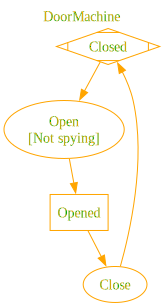

# Nalu.SharpState

[](https://www.nuget.org/packages/Nalu.SharpState/) [](https://www.nuget.org/packages/Nalu.SharpState/) [](https://codecov.io/gh/nalu-development/nalu-sharp-state-machine)

A compile-time, AOT-friendly state machine for .NET built on a Roslyn source generator. You declare states and triggers with attributes, describe transitions with a strongly-typed fluent API, and the generator emits a ready-to-use `IActor` surface with typed trigger methods.

## Why SharpState?

Classic state machine libraries rely on reflection, dictionaries keyed by strings/enums at runtime, and `object[]` parameter bags. That costs boxing, breaks AOT, and pushes errors from compile time to the first user interaction.

`Nalu.SharpState` takes the opposite route:

- **Declarative**: states and triggers are C# constructs (a `static partial` method is a trigger, a `static` property is a state).
- **Strongly typed**: trigger parameters become method parameters on the generated actor. Guards and actions see the exact types you declared.
- **Compile-time validated**: duplicate names, unreachable hierarchies, and misconfigured sub-machines become build errors via dedicated `NSS001`–`NSS011` diagnostics.
- **AOT / trim friendly**: zero reflection at runtime. The generator emits the registration tables at compile time.
- **Hierarchical**: composite states are modeled as nested `[SubStateMachine]` partial classes with strict scoping rules.
- **Sync-first**: generated actors stay synchronous, with optional fire-and-forget `ReactAsync(...)` callbacks for post-transition work.
- **Lightweight on CPU and memory**: tables are emitted at compile time and dispatch is direct, so transitions spend less time on the hot path and allocate far less than typical reflection- or dictionary-heavy approaches. The [Benchmarks](#benchmarks) section compares `Nalu.SharpState` to [Stateless](https://github.com/dotnet-state-machine/stateless) on the same scenarios.

## Installation

```bash
dotnet add package Nalu.SharpState
```

The package bundles the source generator, so no additional setup or `UseXxx(...)` call is required.

## Anatomy of a machine

A machine lives in a single `static partial class` (for example `public static partial class MyMachine`) marked with `[StateMachineDefinition]`. It is made of three building blocks:

| Building block | Declared as | Role |
|----------------|-------------|------|
| **Context** | Any class you own | Carries data into every guard and action. Passed as a type argument to `[StateMachineDefinition]`. |
| **Triggers** | `[StateTriggerDefinition] static partial void` methods | Inputs to the machine. Their parameter list becomes the dispatch signature. At most **three** parameters; group additional values in a `record struct`, a named tuple, or similar and pass that as one parameter (see `NSS011`). |
| **States** | `[StateDefinition] static IStateConfiguration` properties | Nodes of the machine. The property body configures outgoing transitions. |

Here is a minimal door:

```csharp
using Nalu.SharpState;

public class DoorContext
{
    public int OpenCount { get; set; }
    public string? LastReason { get; set; }
}

[StateMachineDefinition(typeof(DoorContext))]
public static partial class DoorMachine
{
    [StateTriggerDefinition] static partial void Open(string reason);
    [StateTriggerDefinition] static partial void Close();

    [StateDefinition(Initial = true)]
    private static IStateConfiguration Closed { get; } = ConfigureState()
        .OnOpen(t => t
            .Target(State.Opened)
            .Invoke((ctx, reason) =>
            {
                ctx.OpenCount++;
                ctx.LastReason = reason;
            }));

    [StateDefinition]
    private static IStateConfiguration Opened { get; } = ConfigureState()
        .OnClose(t => t.Target(State.Closed));
}
```

The generator produces:

- A `State` enum with the values `Closed, Opened`.
- A `Trigger` enum with the values `Open, Close`.
- A nested `public interface IActor` exposing `CanOpen(string)`, `Open(string)`, `CanClose()`, `Close()`, `CurrentState`, `Context`, `IsIn(...)`, `StateChanged`, `ReactionFailed`, and `OnUnhandled`.
- Nested `public delegate IActor CreateActorFactory(DoorContext context)` and `public delegate IActor CreateActorWithStateFactory(DoorContext context, State state)` for dependency injection and tests.
- A `public static State GetInitialState()` helper for the root machine.
- A `public static string ToDot()` helper that renders the machine as a Graphviz DOT graph.
- A `public static IActor CreateActor(DoorContext context)` helper that starts from the root initial state.
- A `public static IActor CreateActorWithState(DoorContext context, State state)` helper for a non-default starting state.

Usage:

```csharp
var door = DoorMachine.CreateActor(new DoorContext());

door.Open("delivery");

Console.WriteLine(door.CurrentState);     // Opened
Console.WriteLine(door.Context.OpenCount); // 1
```

## Describing transitions

Inside each `[StateDefinition]` property body you call `ConfigureState()` and chain one `On<TriggerName>(t => ...)` per trigger the state reacts to. The builder is split into two phases:

| Method | Purpose |
|--------|---------|
| `Target(State s)` | Move to `s` when the trigger fires. If `s` is composite, its initial-child chain is resolved to a leaf. |
| `Target((ctx, args...) => State.X)` | Compute the target at fire time from the context and trigger arguments. |
| `Stay()` | Run the action but keep the current state (internal transition). `StateChanged` is **not** raised. |
| `Ignore()` | Syntax sugar for `Stay()` with no action, useful when a trigger should be accepted but do nothing. This ends the fluent chain. |
| `When(predicate)` | Available on the trigger builder before `Target(...)` or `Stay()`. Guards the transition. The predicate receives the context and trigger arguments. Repeated calls are combined with logical AND in declaration order. |
| `When(predicate, "label")` | Same as `When(predicate)`, but also records the label for DOT graph rendering (only non-null labels are stored). If the transition has a guard but no stored labels, the graph uses a single `Unnamed guard 1` placeholder in the trigger node; multiple stored labels are joined with ` & `. |
| `Invoke(action)` | Available after `Target(...)` or `Stay()`. Runs side effects before the state commits. Repeated calls run in declaration order. |
| `ReactAsync(action)` | Available after `Target(...)` or `Stay()`. Schedules fire-and-forget work after the transition commits and after `StateChanged` fires. Repeated calls run sequentially in declaration order. |

If a dynamic `Target(...)` resolves to the current leaf state for a specific fire, SharpState treats that fire like an internal transition: no exit hooks, no state commit, no entry hooks, and no `StateChanged`.

You can register multiple transitions for the same trigger in the same state; the first one whose guard passes (or has no guard) wins:

```csharp
[StateDefinition]
private static IStateConfiguration Idle { get; } = ConfigureState()
    .OnStart(t => t
        .When((ctx, user) => user.IsAdmin)
        .Target(State.AdminDashboard))
    .OnStart(t => t
        .Target(State.UserDashboard));
```

If no transition matches, the `OnUnhandled` callback fires (see below).

### Entry and exit hooks

States can also react to external transitions with `WhenEntering(...)` and `WhenExiting(...)`:

```csharp
[StateDefinition]
private static IStateConfiguration Running { get; } = ConfigureState()
    .WhenEntering(ctx => ctx.Log.Add("entered running"))
    .WhenExiting(ctx => ctx.Log.Add("leaving running"))
    .OnStop(t => t.Target(State.Stopped));
```

Hooks run only for external transitions:

- Exit hooks run from the current leaf upward until the lowest common ancestor with the destination.
- Entry hooks run from that ancestor's child down to the new leaf.
- Internal transitions (`Stay()` / `Ignore()`) do not fire entry or exit hooks.

## Interacting with the actor

The generated `IActor` exposes everything you need at runtime:

```csharp
var door = DoorMachine.CreateActor(new DoorContext());

door.StateChanged += (from, to, trigger, args) =>
    Console.WriteLine($"{from} -> {to} via {trigger}");

door.OnUnhandled = (current, trigger, args) =>
    logger.LogWarning("{Trigger} ignored while in {State}", trigger, current);

door.Open("delivery");
Console.WriteLine(door.CurrentState);         // Opened
Console.WriteLine(door.IsIn(DoorMachine.State.Opened)); // true
```

| Member | Description |
|--------|-------------|
| `CurrentState` | Current **leaf** state. When the machine is in a nested composite it always reports the leaf. |
| `Context` | The context instance supplied to `CreateActor` / `CreateActorWithState`. |
| `IsIn(State s)` | `true` if `CurrentState` equals `s` **or** is a descendant of `s`. Use this to query composites. |
| `StateChanged` | `StateChangedHandler<State, Trigger>` raised **after** a non-internal transition commits. |
| `ReactionFailed` | Raised when a background `ReactAsync(...)` callback throws after the transition already completed. |
| `OnUnhandled` | Invoked when a trigger has no matching transition on the leaf nor on any ancestor. |
| `Can<Trigger>(...)` | Returns whether the corresponding trigger currently has a matching transition for the supplied arguments. |
| `<Trigger>(...)` | One strongly-typed `void` method per trigger. |

### Benchmarks

Outperform the industry standard ([Stateless](https://github.com/dotnet-state-machine/stateless)) with **4x to 8x faster execution** and **7x to 12x** lower memory overhead depending on the usage.

| Method             | StateChanges | Mean        | Error     | StdDev    | Gen0      | Gen1     | Allocated   |
|------------------- |------------- |------------:|----------:|----------:|----------:|---------:|------------:|
| SingletonActor     | 100          |    10.32 us |  0.029 us |  0.025 us |    4.3945 |        - |    35.94 KB |
| SingletonStateless | 100          |    41.63 us |  0.484 us |  0.404 us |   30.0293 |        - |   245.31 KB |
| TransientActor     | 100          |    11.27 us |  0.027 us |  0.023 us |    5.9204 |        - |    48.44 KB |
| TransientStateless | 100          |    89.98 us |  1.224 us |  1.022 us |   75.0732 |   1.3428 |   614.08 KB |
| SingletonActor     | 10000        | 1,020.74 us |  6.633 us |  5.539 us |  439.4531 |        - |  3593.75 KB |
| SingletonStateless | 10000        | 3,956.54 us | 41.182 us | 38.521 us | 2953.1250 |        - | 24140.63 KB |
| TransientActor     | 10000        | 1,120.78 us |  6.764 us |  5.648 us |  591.7969 |        - |  4843.75 KB |
| TransientStateless | 10000        | 8,699.77 us | 87.558 us | 77.618 us | 7468.7500 | 140.6250 | 61016.85 KB |

See the [benchmarks](https://github.com/nalu-development/sharpstate/tree/main/Tests/Nalu.SharpState.Benchmarks) for more details.

### Graphviz export

Every generated machine also exposes `ToDot()`, which returns a **Graphviz** DOT string. Pass it to the `dot` tool (e.g. `dot -Tpng -o door.png`) or any compatible viewer to visualize transitions, guard labels, and hierarchy.

```csharp
var dot = DoorMachine.ToDot();
Console.WriteLine(dot);
```

The first example on this page is the [door sample](https://github.com/nalu-development/sharpstate/tree/main/Tests/Nalu.SharpState.Tests/EndToEnd/DoorMachine.cs) (`DoorMachine` / `DoorContext`). The DOT below is what `DoorMachine.ToDot()` emits; the image is the same file rendered with `dot -Tpng`.

<table>
<tr valign="middle">
<td>

<pre>
digraph G {
  label = "DoorMachine";
  labelloc = t;
  compound = true;
  start [shape=Mdiamond,label="Closed"];

  state_1 [shape=rectangle,label="Opened"];
  trigger_0 [shape=ellipse,label="Close"];
  state_1 -> trigger_0;
  trigger_1 [shape=ellipse,label="Open\n[Not spying]"];
  start -> trigger_1;

  trigger_0 -> start;
  trigger_1 -> state_1;
}
</pre>

</td>
<td width="35%">



</td>
</tr>
</table>

More generally, the export uses rectangles for states, ellipses for triggers, and appends `When(..., "label")` text inside the trigger label (for example `Open\n[Not spying]`), as in the [transition table](#describing-transitions) above. Cluster subgraphs represent nested regions; `start` and `end` mark the root initial state and terminal states when your machine has them.

### Testability

For application code, prefer injecting the generated **factory delegates** instead of calling the static `CreateActor` / `CreateActorWithState` methods from many places. Most apps register **`CreateActorFactory`**, which matches `CreateActor(DoorContext)` and starts the actor at the machine’s initial state. Use **`CreateActorWithStateFactory`** when callers must pass an explicit `State` (rehydration, tests, or non-default start):

```csharp
services.AddSingleton<DoorMachine.CreateActorFactory>(DoorMachine.CreateActor);

public sealed class DoorWorkflow
{
    private readonly DoorMachine.CreateActorFactory _createDoor;

    public DoorWorkflow(DoorMachine.CreateActorFactory createDoor) => _createDoor = createDoor;

    public DoorMachine.IActor Start(DoorContext context) => _createDoor(context);
}
```

If you need a specific starting `State` instead of the root initial state:

```csharp
services.AddSingleton<DoorMachine.CreateActorWithStateFactory>(DoorMachine.CreateActorWithState);

// ... inject CreateActorWithStateFactory and call: _createDoor(context, DoorMachine.State.Closed);
```

This keeps actor creation DI-friendly and unit-testable:

- tests can replace `CreateActorFactory` (or `CreateActorWithStateFactory`) with a lambda
- the lambda can return a mocked or fake `DoorMachine.IActor`
- production code can still use `DoorMachine.CreateActor` or `DoorMachine.CreateActorWithState` as the implementation behind the delegate

### Unit testing

With `NSubstitute`, a unit test can stub both the factory and the generated actor:

```csharp
var actor = Substitute.For<DoorMachine.IActor>();
var factory = Substitute.For<DoorMachine.CreateActorFactory>();
factory(Arg.Any<DoorContext>()).Returns(actor);

var workflow = new DoorWorkflow(factory);
var result = workflow.Start(new DoorContext());

result.Should().BeSameAs(actor);
```

And if your application code calls triggers on the actor, you can verify those too:

```csharp
var actor = Substitute.For<DoorMachine.IActor>();

actor.Open("delivery");

actor.Received().Open("delivery");
```

### Unhandled triggers

`OnUnhandled` defaults to a handler that throws `InvalidOperationException` with the current state and trigger in the message. This surfaces programming mistakes early (e.g. firing `Close` while the door is already closed and no `.OnClose` is configured for that state).

You have three options:

```csharp
// 1) Default: throws on unhandled
door.Open("again");  // InvalidOperationException if not configured

// 2) Custom handler (logging, metrics, retries...)
door.OnUnhandled = (state, trigger, args) =>
    telemetry.Track("UnhandledTrigger", state, trigger);

// 3) Opt out: silent no-op
door.OnUnhandled = null;
```

If a trigger should be accepted silently from a given state, prefer modeling that directly:

```csharp
[StateDefinition]
private static IStateConfiguration Running { get; } = ConfigureState()
    .OnHeartbeat(t => t.Ignore());
```

### StateChanged

`StateChanged` fires once per committed transition, with the original leaf, the new leaf, the trigger, and a `TriggerArgs` value carrying the trigger payload.

- Use `args.Get<T>(index)` to read the *n*th argument with the type you expect (the same `T` the trigger was fired with at that position).
- Use `args.ToArray()` when you need a conventional `object?[]` (for example logging every value without knowing arity up front). Up to **three** arguments are stored inline; you normally do not need the array in application code.

```csharp
door.StateChanged += (from, to, trigger, args) => { /* log, react, ... */ };
```

It is **not** raised when:

- The transition is internal (`.Stay()`).
- A dynamic `Target(...)` resolves to the current leaf, so that fire collapses into internal behavior.
- The trigger was unhandled (`OnUnhandled` is raised instead).

## Guards and actions

Guards and actions both receive the context followed by the trigger's parameters — exactly the parameters you declared on the `partial void` method:

```csharp
[StateTriggerDefinition] static partial void Withdraw(decimal amount, string note);

[StateDefinition]
private static IStateConfiguration Open { get; } = ConfigureState()
    .OnWithdraw(t => t
        .When((ctx, amount, _) => amount <= ctx.Balance)
        .Target(State.Open)
        .Invoke((ctx, amount, note) =>
        {
            ctx.Balance -= amount;
            ctx.Ledger.Add(($"-{amount}", note));
        }))
    .OnWithdraw(t => t
        .Stay()
        .Invoke((ctx, amount, note) =>
            ctx.Ledger.Add((note, $"insufficient for {amount}"))));
```

Guards are pure predicates — keep them free of side effects. `Invoke(...)` runs inline during dispatch and any exception it throws propagates out of `Fire(...)` before the new state is committed.

### ReactAsync

Use `ReactAsync(...)` when the transition should commit immediately but you still want to kick off asynchronous follow-up work:

```csharp
[StateDefinition]
private static IStateConfiguration Pending { get; } = ConfigureState()
    .OnRequestApproval(t => t
        .Target(State.Approving)
        .ReactAsync(async (actor, ctx, id) =>
        {
            try {
                await ctx.ApproveService.ApproveAsync(id);
                actor.Approve();
            } catch {
                actor.Reject();
            }
        }));
```

For external transitions, the order is:

1. `WhenExiting(...)`
2. `Invoke(...)`
3. state commit
4. `WhenEntering(...)`
5. `StateChanged`
6. `ReactAsync(...)`

`ReactAsync(...)` captures the current `SynchronizationContext` when the trigger is fired. The callback receives the generated actor instance first, so it can trigger additional transitions after the awaited work completes. If the background reaction throws, the exception is surfaced through `ReactionFailed`.

## What next?

- [Hierarchical State Machines](sharpstate-hierarchy.md) — nested composite states via `[SubStateMachine]`.
- [Post-Transition Reactions](sharpstate-async.md) — background `ReactAsync(...)` work and `ReactionFailed`.
- [Diagnostics & Troubleshooting](sharpstate-diagnostics.md) — generator errors (`NSS001`–`NSS011`) and common pitfalls.
